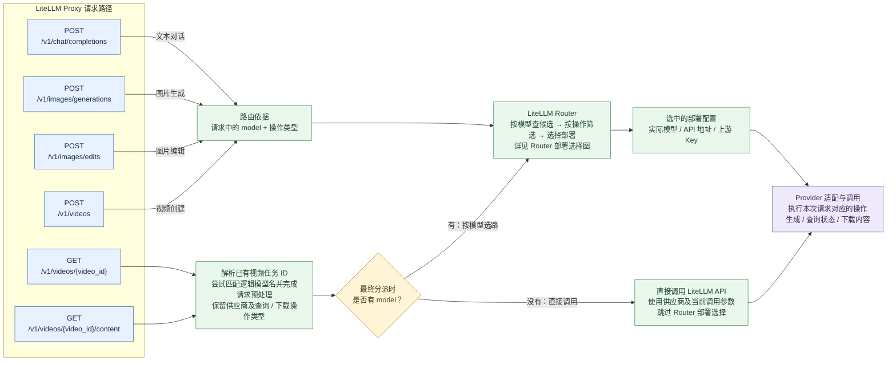

# 请求路径与路由分流

本图按 HTTP 方法和路径区分文本对话、图片生成 / 编辑、视频创建 / 查询 / 下载。所有入口先经过 LiteLLM Proxy 鉴权；共同的请求预处理在图中省略，重点展示请求依据什么进入 Router 或直接调用 Provider。

| 请求路径 | 保留到后续调用的操作类型 |
| --- | --- |
| `POST /v1/chat/completions` | `acompletion` |
| `POST /v1/images/generations` | `aimage_generation` |
| `POST /v1/images/edits` | `aimage_edit` |
| `POST /v1/videos` | `avideo_generation` |
| `GET /v1/videos/{video_id}` | `avideo_status` |
| `GET /v1/videos/{video_id}/content` | `avideo_content` |

- **合流后仍保留操作类型**：图片生成和编辑使用不同 Router 方法；视频查询和下载也不会因合流而变成新建视频请求。
- **图示范围**：带模型的新建请求按已配置模型的常规选路路径展示。视频任务请求在分派时没有模型名，可直接调用对应 LiteLLM API；直调能否成功仍取决于供应商配置和任务本身。`GET /v1/models` 属于模型目录查询，不进入本图的供应商选路流程。
- **任务 ID 与具体部署**：视频任务 ID 携带供应商、可选模型信息及上游任务 ID，不保存上游 API Key。恢复逻辑模型名后仍可能重新选部署，不保证沿用创建任务时的上游 Key；显式请求参数也可能覆盖 ID 中的供应商信息。

继续阅读：[Router 部署选择](router.md)。

源码定位：[文本入口](../litellm/proxy/proxy_server.py)、[图片入口](../litellm/proxy/image_endpoints/endpoints.py)、[视频入口](../litellm/proxy/video_endpoints/endpoints.py)、[请求分派](../litellm/proxy/route_llm_request.py)。
