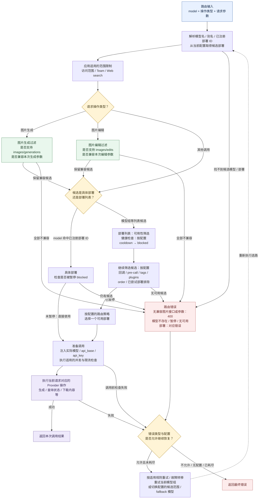

# Router 部署选择

从 [请求路径与路由分流](request-routing.md) 中的 Router 节点进入本图。输入包括 `model`、请求操作类型及参数；本图展开当前 Proxy 使用的异步 Router 选路流程。

- **图片专属过滤**：当前接口能力映射覆盖图片生成和图片编辑；其他操作跳过这两类过滤。未声明接口能力的旧配置兼容放行；没有待检图片参数时，相应参数检查放行。
- **固定部署与模型组**：`model` 命中已注册部署 ID 时，仍执行适用的图片检查和 `blocked` 检查，随后跳过列表的健康、cooldown、策略选择。`specific_deployment=True` 按实际模型名寻找部署列表，不等同于固定唯一部署 ID。
- **可用性与恢复**：图中展示筛选主顺序；健康路由在部分条件下会恢复候选，不能把它理解为每轮都严格剔除所有不健康部署。重试和 fallback 受错误类型、配置与次数约束；重新选路不保证更换部署。
- **配置来源**：候选部署来自 Router 当前加载的 YAML / DB 模型配置。供应商尺寸规格、计费、日志及结果存储不在本图展开。

源码定位：[候选获取与部署 ID 分支](../litellm/router.py)（`_common_checks_available_deployment`）、[异步筛选与策略选择](../litellm/router.py)（`async_get_available_deployment`）、[Provider 调用](../litellm/router.py)（`_ageneric_api_call_with_fallbacks`）。
